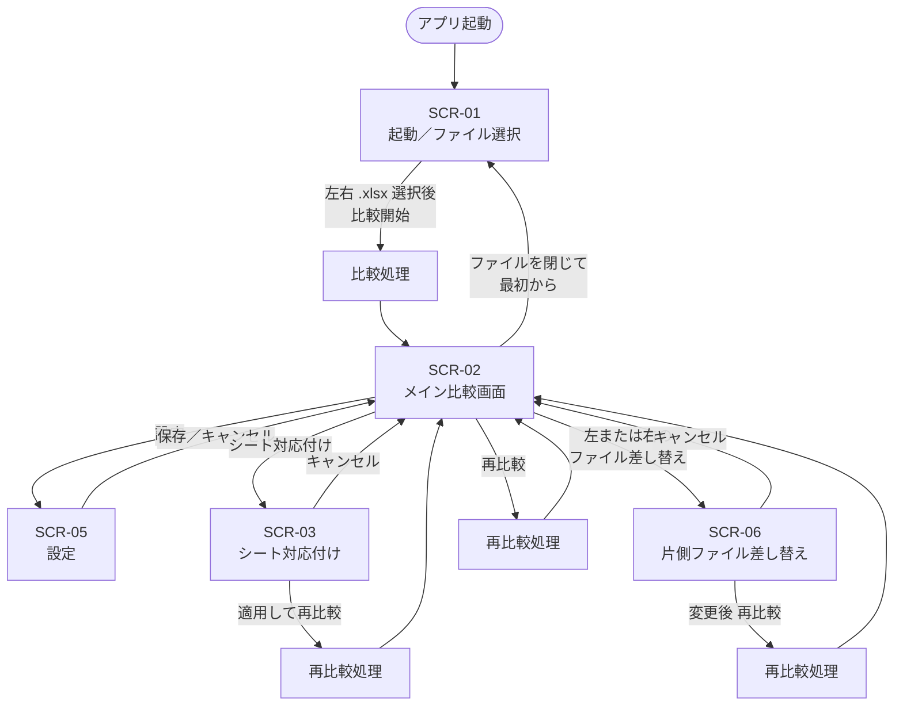

# DiffXL 要件定義

| 項目 | 内容 |
|------|------|
| 文書名 | DiffXL 要件定義 |
| 対象 | 新規作成アプリケーション |
| 作成日 | 2026-08-11 |
| ステータス | 草案（内容ベース方針へ改訂） |
| 版 | 0.5 |

**関連設計:** `docs/superpowers/specs/2026-08-12-content-based-diff-design.md`（**承認済み**）  
**実装計画:** `docs/superpowers/plans/2026-08-12-content-based-diff.md`

---

## 1. 概要

### 1.1 アプリケーションの目的

**DiffXL** は、2つの Excel ファイル（**`.xlsx` のみ**）を比較し、**どこが違うのかを分かりやすく見せる**デスクトップアプリケーションである。

主に次のような差分を対象とする。

- テキスト（セル値）の変更・個数差
- セル背景色の差
- テーブル行の追加・削除・行内セル変更
- 埋め込みイメージの見た目差・追加・削除
- 図形の内容差・片側のみ
- シート構成の不一致

### 1.2 参考イメージ

画面の使い勝手・比較の考え方は **WinMerge** に近い。

- 左右分割で2ファイルを並べて表示
- 差分の強調表示と選択同期
- MiniMap による**現在シート**の差分俯瞰とジャンプ

### 1.3 最優先方針（内容比較）

本アプリの最重要品質は **内容差分の正確さ・分かりやすさ・安定性** である。

- セル番地・画像アンカー位置は比較キーに**しない**（中身が同じなら差分に出さない）
- テーブルは行シーケンスとして追加・削除・変更が一目で分かること
- 画像は出現順の系列アラインメント＋見た目比較（位置・パス差は無視）
- 表示は **自前の内容ビュー（WPF）** のみ。Excel そっくりの 1px 再現は目標としない
- **Microsoft Excel のインストールおよび COM 埋め込みには依存しない**

行高・列幅・フォントスタイル・罫線スタイルの差分は対象外（border 有無は表検出にのみ使用）。

詳細な比較モデルは設計書を正とする。

---

## 2. 主要機能

### 2.1 内容ビュー（ビューモード）

| # | 要件 | 詳細 |
|---|------|------|
| V-01 | 内容ビュー表示（最重要） | `.xlsx` から抽出した内容（セル・テーブル・画像・図形）を **自前 WPF ビュー** で左右表示する |
| V-01a | Excel 非依存 | Excel 未インストールでも比較・閲覧できる |
| V-01b | 位置非再現 | 行高・列幅の Excel 1px 再現は行わない（内容の対応関係を示す） |
| V-01c | 画像・図形表示 | 埋め込み画像・図形を内容ビュー上で確認できる |
| V-01d | 内容ストリーム | セル／表／画像／図形を文書順の 1 本のストリームで表示する。種別はフィルタで絞る（タブ分割はしない） |
| V-02 | 左右分割表示 | 画面を左右に分け、2つのブック内容を同時に表示する |
| V-03 | テキスト表示 | セル表示値（数式はキャッシュ値優先）を正しく表示する |
| V-04 | イメージ表示 | 抽出した埋め込みイメージを正しく表示する |
| V-05 | 読み取り専用ビュー | 比較アプリとしての主用途は閲覧・差分確認。編集・書き戻しは対象外 |
| V-06 | 差分強調 | 差分箇所を強調表示する（画像は赤枠＋黄半透明など。既定・設定は §2.6） |
| V-07 | 差分強調の表示切替 | ツールバー等の **表示／非表示トグル** で差分強調を一括で消せる／再表示できる |

**補足（`.xlsx` の構造）**

- 対象形式は **`.xlsx` のみ**（`.xls` / `.xlsm` 等は対象外）
- `.xlsx` は ZIP（OOXML）形式である
- 解凍すると埋め込みイメージをファイルとして把握できる
- 比較時は、この構造を利用してセル・背景色・border・画像・図形を抽出する

### 2.2 比較機能

| # | 要件 | 詳細 |
|---|------|------|
| C-01 | シート単位の比較 | 基本は **同名シート同士** を比較する |
| C-02 | 手動シート選択 | シート名が合わない場合など、左右で**異名シートを手動対応**できる |
| C-03 | 片側のみシート | 片方にしかないシートは Structure 差分とし、内容は片側表示できる |
| C-04 | セル多重集合比較 | テーブル外セルは位置無視の多重集合（値＋背景色）。同一内容の個数差を検出する |
| C-05 | テーブル行比較 | border 検出した表について、行 LCS により追加・削除・行内セル変更を検出する |
| C-06 | イメージ差分 | OpenCV（**x64**）で見た目を比較し、有意領域を **赤枠＋黄色半透明** 等で強調する |
| C-07 | 片側のみ存在するイメージ | 出現順 DP により片側のみ画像を Skip し、後続を再同期する |
| C-08 | 画像の位置無視 | 見た目が同じならアンカー位置・パッケージパスが違っても差分に出さない |
| C-09 | 内容理解に基づく比較 | 部品分解した意味モデル同士を比較する（Excel 画面座標に依存しない） |

### 2.3 同期・ナビゲーション

| # | 要件 | 詳細 |
|---|------|------|
| N-01 | 選択同期 | 差分選択・ペア行・テーブル対応行の選択を左右で連動する |
| N-02 | MiniMap | **現在シート**の差分位置を MiniMap で俯瞰できる（全シート横断はしない） |
| N-03 | MiniMap 操作 | MiniMap のクリックで本体ビューも連動して移動する |
| N-04 | 前後差分 | 現在シート内で次の差分／前の差分へ移動できる（F8 / Shift+F8） |

### 2.4 ファイル操作・再比較

| # | 要件 | 詳細 |
|---|------|------|
| F-01 | 起動時比較 | アプリ起動後、2つの Excel ファイル（`.xlsx`）を選択すると比較を開始する |
| F-02 | 片側ファイル変更 | 左右それぞれで、別ファイルへ差し替えできる |
| F-03 | 再比較 | ファイル変更後などに再比較を実行できる |
| F-04 | 形式チェック | `.xlsx` 以外が選ばれた場合は受け付けず、エラーメッセージを表示する |

### 2.5 設定

| # | 要件 | 詳細 |
|---|------|------|
| S-01 | 設定画面 | 設定専用画面を持つ |
| S-02 | 設定保存形式 | 設定は **YAML** ファイルとして保存する |
| S-03 | 設定保存場所 | `%AppData%\Roaming\DiffXL\` 配下に保存する（§4.5） |
| S-04 | 差分色の変更 | 差分強調色・不透明度・画像ハイライト枠等を設定画面から変更でき、YAML に永続化する |

### 2.6 差分色・強調表示

| # | 要件 | 詳細 |
|---|------|------|
| D-01 | 既定の差分色（一般） | **黄色**、**不透明度 50%**（アルファ 0.5）を基本とする |
| D-01a | 画像ハイライト既定 | 枠 **赤・3px**、塗り **黄・不透明度 50%** |
| D-02 | 色の変更 | 設定で色（例: `#AARRGGBB` または RGB＋不透明度）を変更できる |
| D-03 | 適用範囲 | テキスト・テーブル・画像など、視覚的な差分強調に同じ方針を基本適用する（個別色が必要な場合は設定で分離可） |
| D-04 | 表示／非表示 | メイン画面の切替ボタンで、差分強調を **ワンクリックで非表示／再表示** できる |
| D-05 | 切替の独立性 | 表示をオフにしても比較結果データは保持する。再比較は不要で、表示だけ切り替える |

---

## 3. 画面構成・遷移

### 3.1 方針

1. **まず HTML で画面レイアウト／遷移を作成・確認する**（初期プロトタイプ）
2. **WPF として実装**し、表示は **自前内容ビュー** とする
3. Excel COM 埋め込みは **採用しない**（廃止済み）

### 3.2 画面一覧

| ID | 画面名 | 種別 | 役割 |
|----|--------|------|------|
| SCR-01 | 起動／ファイル選択 | 画面 | 起動直後。左右の `.xlsx` を選んで比較開始 |
| SCR-02 | メイン比較画面 | 画面 | 左右内容ビュー、差分強調、MiniMap、シート切替、再比較 |
| SCR-03 | シート対応付け | ダイアログ | 比較対象シートの手動対応（同名・異名・片側） |
| SCR-05 | 設定 | 画面／ダイアログ | YAML に保存する各種設定の編集 |
| SCR-06 | 片側ファイル差し替え | ダイアログ | 左または右のみ別ファイルへ変更 |

> 注: 旧「アンカー設定（SCR-04）」は位置無視方針と矛盾するため初期スコープ外（廃止）。

### 3.3 画面遷移図



### 3.4 遷移の補足ルール

| 操作 | 遷移 | 備考 |
|------|------|------|
| 起動直後 | SCR-01 | Excel 利用可否チェックは**行わない** |
| ファイル選択 | SCR-01 / SCR-06 | **`.xlsx` のみ**受け付ける |
| 比較開始／再比較 | 処理中インジケータ → SCR-02 | 失敗時はメッセージ表示し元画面へ |
| シート対応付け | SCR-02 上にモーダル | 適用時に再比較 |
| 片側差し替え | SCR-02 上にファイル選択 | 変更後は再比較を促す／自動再比較 |
| 設定 | SCR-05 | 保存先は AppData 配下 YAML。比較結果は破棄しない |

### 3.5 メイン画面レイアウト案（SCR-02）

```
┌─────────────────────────────────────────────────────────────┐
│  メニュー / ツールバー（再比較・差分強調ON/OFF・設定 など）    │
├──────────────────────┬──────────────────────┬───────────────┤
│  左: ファイルA        │  右: ファイルB        │  MiniMap      │
│  シート選択           │  シート選択           │  （現在シート）│
│  ┌────────────────┐  │  ┌────────────────┐  │               │
│  │ 内容ビュー     │  │  │ 内容ビュー     │  │               │
│  │ セル/表/画像   │↔ │  │ セル/表/画像   │  │  [クリック連動]│
│  │ 内容ストリーム │  │  │ 内容ストリーム │  │               │
│  │                │  │  │                │  │               │
│  └────────────────┘  │  └────────────────┘  │               │
├──────────────────────┴──────────────────────┴───────────────┤
│  ステータスバー（比較結果サマリ・進捗 など）                   │
└─────────────────────────────────────────────────────────────┘
```

### 3.6 HTML プロトタイプ

| 項目 | 内容 |
|------|------|
| 保存場所 | `10_管理資料/画面プロトタイプ/` |
| エントリ | `index.html` をブラウザで開く |
| 内容 | SCR-01〜06 のレイアウト・遷移・差分表示の見た目確認用（初期案） |
| 注意 | 見た目・操作感の確認用。現行の内容ビュー実装とは細部が異なる場合がある |

詳細な操作手順は `10_管理資料/画面プロトタイプ/README.md` を参照。

---

## 4. 技術要件

### 4.1 プラットフォーム・UI

| 項目 | 方針 |
|------|------|
| OS | Windows |
| アーキテクチャ | **x64 のみ**（x86 / AnyCPU は対象外） |
| UI フレームワーク | WPF |
| 画面プロトタイプ | HTML（レイアウト・遷移の先行確認用・歴史的成果物） |
| スタイル | `STYLE` フォルダで共通スタイルを宣言し、全要素は基本的に同一デザインを利用する |
| 実行前提ソフト | **Microsoft Excel は不要**（COM 不使用） |
| 対象ファイル形式 | **`.xlsx` のみ** |

### 4.2 ビュー実装方式（確定: 自前内容ビュー）

| レイヤ | 役割 | 方式 |
|--------|------|------|
| **主表示** | ユーザーが差分を確認する領域 | **WPF 内容ビュー**（ContentPane / 表グリッド / 画像ペア等） |
| **比較エンジン** | 差分検出 | OOXML 抽出 ＋ 部品比較（セル bag / 表行 LCS / 画像 DP）＋ OpenCV |

#### 4.2.1 主表示（内容ビュー）

- 左右ペインそれぞれに内容ビューを載せる
- Excel 見た目の 1px 再現は行わない
- 比較用途のため、**読み取り専用**（編集・書き戻しは対象外）

#### 4.2.2 比較・強調

- 埋め込み画像の抽出（`.xlsx` ZIP 構造）
- OpenCV による画像見た目差分と領域ハイライト
- MiniMap（現在シートの差分のみ）
- テキスト／テーブル差分の視覚表現

#### 4.2.3 採用しない方式

| 方式 | 却下理由 |
|------|----------|
| Excel COM 埋め込みハイブリッド | 安定性・依存・価値の問題。内容比較方針と矛盾 |
| HTML/Markdown を主比較経路 | 構造同期・画像スキップが弱くノイズになりやすい |
| 商用 Spreadsheet コントロールのみ | ライセンス制約・本方針との不一致 |

### 4.3 ファイル・画像処理

| 項目 | 方針 |
|------|------|
| 対象形式 | **`.xlsx` のみ**（ZIP 構造を利用した内容・イメージ抽出） |
| Excel 連携 | **なし**（COM/Interop 不使用） |
| イメージ差分 | **OpenCV x64** により比較し、有意領域を強調表示 |
| 比較対象の理解 | 部品分解した意味モデル（WorkbookContent / SheetContent）で比較する |
| 差分強調 UI | 内容ビュー上で強調。画像は赤枠3px＋黄50%既定。表示／非表示トグル必須 |

### 4.4 ライブラリ・OSS 方針

| 項目 | 方針 |
|------|------|
| 基本姿勢 | **オープンソースライブラリを最大限利用**する |
| 改修方針 | 必要に応じて **ソースをダウンロードし、改修して使用**する |
| 取り込み場所 | 改修した OSS は `20_ソース` 配下などプロジェクト管理下に置き、由来・ライセンス・改変内容を追跡できるようにする |
| ライセンス | 利用・改変・再配布条件を遵守し、必要な表記を成果物／リポジトリに残す |
| 商用コンポーネント | 原則使用しない |
| 想定利用例 | YAML（設定）、ログ基盤、単一 exe 化（Costura.Fody 等）、OpenCV .NET バインディング、`.xlsx` OOXML 解析 など |

### 4.5 データ保存場所（AppData）

ログ・キャッシュ・設定・展開済みネイティブ DLL など、実行時に生成・保持するデータは、原則すべて次に集約する。

```
%AppData%\Roaming\DiffXL\
  ├── settings.yaml          # ユーザー設定（YAML）
  ├── logs\                  # ログ（1日1ファイル）
  │     └── DiffXL_yyyyMMdd.log
  ├── cache\                 # キャッシュ（画像抽出、一時ファイル等）
  └── native\                # 埋め込みから展開したネイティブ DLL（OpenCV 等）
```

| 項目 | 方針 |
|------|------|
| ルート | `%AppData%\Roaming\DiffXL`（環境変数 `APPDATA` = Roaming） |
| 設定 | `settings.yaml` |
| ログ | `logs\` 配下。**1日1ファイル**。ファイル名例: `DiffXL_yyyyMMdd.log` |
| キャッシュ | `cache\` 配下。再比較や一時ファイルに使用。削除可能であることを前提とする |
| ネイティブ | `native\` 配下。初回起動時などに exe 内リソースから展開 |
| 実装 | 設定は `AppSettings`、ログは `Log.cs` など共通クラスからパスを解決する |

### 4.6 設定・ログ API

| 項目 | 方針 |
|------|------|
| 設定 | 専用設定画面 ＋ YAML 保存（AppData 配下） |
| ログ実装場所 | `Log.cs` |
| ログ出力先 | `%AppData%\Roaming\DiffXL\logs\` |
| ログファイル分割 | **1日1ファイル** |
| 呼び出し例 | `Log.Info("")` / `Log.Debug("")` / `Log.Error("")` / `Log.Exception(ex)` |
| 利用方針 | どこからでも簡単に呼べること |

### 4.7 ビルド・配布（単一 exe）

| 項目 | 方針 |
|------|------|
| ビルド構成 | **x64** 固定 |
| 配布単位 | ユーザーが扱う成果物は原則 **`DiffXL.exe` のみ** |
| マネージ DLL | **Costura.Fody 等**により exe に埋め込み、出力フォルダに DLL を並べない |
| ネイティブ DLL | OpenCV 等はリソースとして exe に含め、実行時に `%AppData%\Roaming\DiffXL\native\` へ展開して読み込む |
| 設定ファイル | exe 横に必須の config を置かない方針（必要な設定は AppData の YAML） |
| リリース置き場 | `40_リリース` に exe（と必要なら簡易 README）を配置 |
| 注意 | Debug 作業時は埋め込み無効化や展開ログの確認を許容する。Release 配布形態は単一 exe を守る |

---

## 5. コーディング規約（強制）

次を **必須** とする。

1. **すべてのソース**について、メソッド・クラス・変数の **直上に日本語コメント** を付ける
2. WPF スタイルは **`STYLE` フォルダの共通定義** を利用し、画面ごとにバラバラな見た目にしない
3. ログは `Log.cs` の共通 API を利用する
4. 設定・ログ・キャッシュ・ネイティブ展開パスは **AppData 配下**に統一し、ハードコード散在を避ける
5. プラットフォーム依存コードは **x64** 前提で書く（誤って x86 専用パスを取らない）

コメント例（イメージ）:

```csharp
/// <summary>
/// 左右の Excel ファイルを比較し、差分結果を返す。
/// </summary>
public class DiffEngine
{
    /// <summary>
    /// 比較対象の左ファイルパス。
    /// </summary>
    private string leftPath;

    /// <summary>
    /// 指定シート同士の比較を実行する。
    /// </summary>
    public DiffResult Compare(string sheetName)
    {
        // ...
    }
}
```

---

## 6. 想定される差分パターン

実装・テスト時に意識する主なパターン。

| パターン | 内容 |
|----------|------|
| セル位置差のみ | 同一値・異番地 → 差分なし |
| 背景色のみ差 | 同一テキスト・背景のみ差 → Background |
| テキスト個数差 | 同一値の出現回数差 |
| テーブル行削除／追加 | 12345 vs 1245 等 → TableRowDelete / Insert |
| テーブル内セル変更 | 対応行内の文言変更 → TableCellChange |
| イメージ部分変更 | 見た目の一部だけ変わる（領域ハイライト） |
| イメージ追加 | 片方にのみ画像（系列再同期） |
| イメージ位置差のみ | 同見た目・異アンカー → 差分なし |
| シート不一致 | 同名／片側のみ／異名手動対応 |
| 図形 | 順序＋内容。片側のみ含む |

必須シナリオの詳細は設計書 §7.1 および `30_参考資料/samples/content_diff_*.xlsx` を参照。

---

## 7. 比較ロジック方針（概念）

```
1. 実行環境確認
   - x64 プロセス
   - Excel は不要
2. 左右ファイルを OOXML として読み込み（.xlsx のみ）
3. ContentExtractor → WorkbookContent / SheetContent
4. 比較対象シートを決定
   - 既定: 同名シート
   - 例外: ユーザーが手動対応
   - 片側のみ: Structure
5. 部品ごと比較
   - テーブル外セル → 多重集合（Text + Background）
   - テーブル → border 検出 → 行 LCS
   - 画像 → 出現順 DP ＋ OpenCV 見た目
   - 図形 → 順序＋内容
6. DiffResult を内容ビュー・MiniMap・差分リストへ反映
7. 一時データは %AppData%\Roaming\DiffXL\cache 等に保存
```

---

## 8. 非機能・品質

| 項目 | 方針 |
|------|------|
| 内容正確性 | 位置に依存せず、中身の差が正しく出ること |
| 分かりやすさ | 差分位置・内容が視覚的にすぐ分かること（色強調・MiniMap・表の行削除表示） |
| 操作性 | WinMerge 的な直感操作（選択同期、再比較、片側差し替え） |
| 安定性 | Excel COM に依存せず、埋め込み不安定さを排除する |
| 配布容易性 | 原則 **単一 exe**。依存 DLL をユーザーに意識させない。**Excel 不要** |
| データ配置 | 設定・ログ・キャッシュ・ネイティブ展開は AppData に集約 |
| 保守性 | 共通スタイル、共通ログ、日本語コメント必須、OSS 改変の追跡 |
| 拡張性 | 設定は YAML で外出し |

---

## 9. 今後の成果物（予定）

| 順 | 成果物 | 置き場所 | 状態 |
|----|--------|----------|------|
| 1 | 本要件定義 | `10_管理資料/要件定義.md` | 作成済（版 0.5 内容ベース改訂） |
| 2 | 画面遷移図 | 本資料 §3.3 | 作成済 |
| 3 | 画面レイアウト HTML プロトタイプ | `10_管理資料/画面プロトタイプ/` | 作成済（初期案） |
| 4 | 内容ベース比較設計書 | `docs/superpowers/specs/2026-08-12-content-based-diff-design.md` | **承認済み** |
| 5 | 内容ベース比較実装計画 | `docs/superpowers/plans/2026-08-12-content-based-diff.md` | 実施中〜完了想定 |
| 6 | WPF 実装（x64・内容ビュー・単一 exe） | `20_ソース` | 作成済（計画 01〜06 ＋内容ベース改修） |
| 7 | リリース成果物（`DiffXL.exe`） | `40_リリース` | 作成済（Release\|x64） |

---

## 10. 未決事項・確認ポイント

### 10.1 確定済み

- [x] 対象形式 → **`.xlsx` のみ**
- [x] プラットフォーム → **Windows x64 のみ**
- [x] OpenCV → **x64 のみ**
- [x] 最重要品質 → **内容差分の正確さ・分かりやすさ・安定性**
- [x] ビュー実装方式 → **自前内容ビュー（Excel COM 埋め込み廃止）**
- [x] Excel インストール → **不要**
- [x] 比較キー → **内容**（セル番地・画像位置はメタデータのみ）
- [x] MiniMap → **現在シートのみ**
- [x] 画像ハイライト既定 → **赤枠 3px ＋ 黄 50%**、トグル必須
- [x] データ保存先 → **`%AppData%\Roaming\DiffXL`**（設定・ログ・キャッシュ・native）
- [x] 配布形態 → **原則単一 exe**（Costura.Fody 等 ＋ ネイティブは AppData 展開）
- [x] OSS 方針 → **最大限利用し、必要ならソース改修して使用**
- [x] 差分色（一般） → **既定: 黄色・不透明度 50%**。設定で変更可能
- [x] 差分強調の表示切替 → **表示／非表示トグル**で簡単に切替（データは保持）

### 10.2 未決

- [ ] YAML 設定項目の完全一覧（差分色・画像ハイライト以外の項目）
- [ ] 採用 OSS の確定リストとライセンス表記の置き場所の最終整備
- [ ] HTML プロトタイプと現行内容 UI の差分の整理（必要なら更新）

### 10.3 計画書

具体的な実装計画は `10_管理資料/計画/` および `docs/superpowers/plans/` を参照する。

| 文書 | 内容 |
|------|------|
| `00_全体ロードマップ.md` | 計画分割・依存関係・実施順序（内容ベース計画への参照あり） |
| `01_基盤_AppData設定ログ_x64単一exe.md` | 基盤インフラ |
| `02_ExcelCOMハイブリッドビュー.md` | **歴史的計画**（Excel 埋め込み。現行方針では廃止） |
| `03_比較エンジン_xlsx_OpenCV.md` | 比較ロジック（内容ベースへ拡張） |
| `04_差分オーバーレイ_色_表示切替.md` | 差分強調 UI |
| `05_UI統合_同期スクロール_MiniMap.md` | 画面統合・ナビ |
| `06_リリース配布_検証.md` | 配布と検証 |
| `docs/superpowers/plans/2026-08-12-content-based-diff.md` | **現行本線:** Excel 廃止・内容ベース比較 |

---

## 改訂履歴

| 版 | 日付 | 内容 |
|----|------|------|
| 0.1 | 2026-08-11 | 初版（ヒアリング内容を整理して作成） |
| 0.2 | 2026-08-11 | 画面一覧・画面遷移図・HTML プロトタイプを追加 |
| 0.3 | 2026-08-11 | x64 専用、`.xlsx` のみ、Excel 本体＋差分画像のハイブリッド表示、AppData 集約、単一 exe 配布、OSS 改修利用方針を反映 |
| 0.4 | 2026-08-11 | Excel 全バージョン対応、差分色（黄・50%透明・設定可）、差分表示トグル、計画書へのリンクを追加 |
| 0.5 | 2026-08-12 | **内容ベース比較へ方針転換**。Excel COM 埋め込み廃止・自前内容ビュー・位置非依存比較・MiniMap 現在シートのみ。設計書・実装計画へのリンクを追加 |
