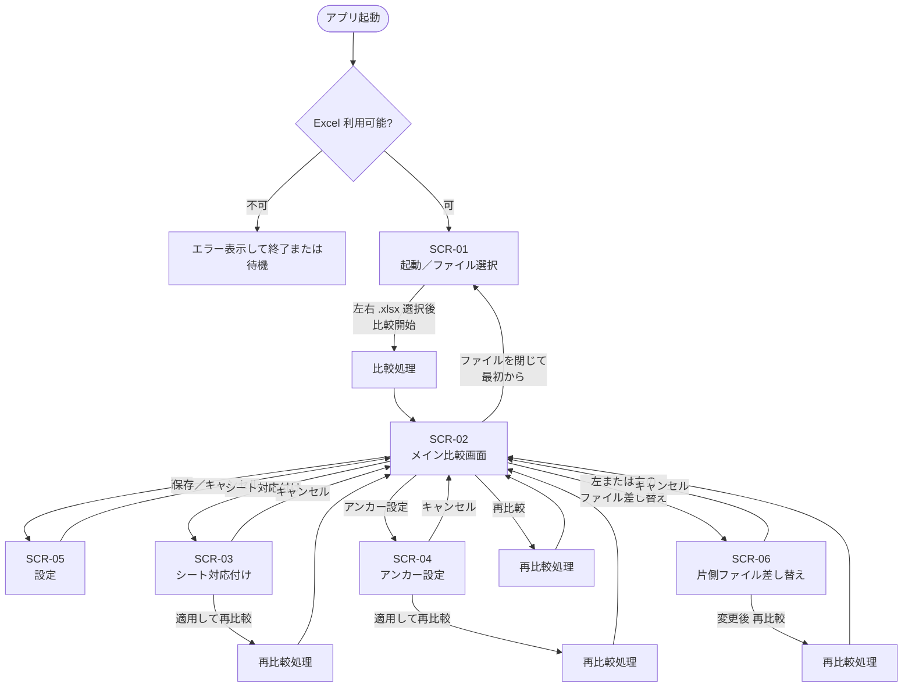

# DiffXL 要件定義

| 項目 | 内容 |
|------|------|
| 文書名 | DiffXL 要件定義 |
| 対象 | 新規作成アプリケーション |
| 作成日 | 2026-08-11 |
| ステータス | 草案 |
| 版 | 0.4 |

---

## 1. 概要

### 1.1 アプリケーションの目的

**DiffXL** は、2つの Excel ファイル（**`.xlsx` のみ**）を比較し、**どこが違うのかを分かりやすく見せる**デスクトップアプリケーションである。

主に次のような差分を対象とする。

- テキストの一部変更
- 埋め込みイメージの一部変更
- イメージの追加
- シート構成の不一致

### 1.2 参考イメージ

画面の使い勝手・比較の考え方は **WinMerge** に近い。

- 左右分割で2ファイルを並べて表示
- 同期スクロール
- 差分の強調表示
- MiniMap による差分の俯瞰とジャンプ

### 1.3 最優先方針（ビュー再現）

本アプリの最重要品質は **Excel をビューモードとして「そのまま」表示すること** である。

- 行の高さ・列の幅をそのまま再現する
- フォント・フォントサイズをそのまま再現する
- 図形・埋め込みイメージなどを完璧に表示する
- **レイアウトの 1px ずれを許容しない**

この再現品質は、自前描画や一般的な表コントロールでは保証できないため、**インストール済み Microsoft Excel 本体による描画**を必須とする（詳細は §4.2）。

---

## 2. 主要機能

### 2.1 Excel ビューアー（ビューモード）

| # | 要件 | 詳細 |
|---|------|------|
| V-01 | 完全ビュー表示（最重要） | `.xlsx` の内容を Excel 本体描画により **そのまま** ビューモードで表示する |
| V-01a | 行高・列幅 | Excel 上の行の高さ・列の幅と一致させる |
| V-01b | フォント | フォント名・フォントサイズを一致させる |
| V-01c | 図形・イメージ | 図形・埋め込みイメージ等を欠落・ずれなく表示する |
| V-01d | 1px 精度 | 表示レイアウトの **1px ずれを許容しない**（再現責任は Excel 本体描画に置く） |
| V-02 | 左右分割表示 | 画面を左右に分け、2つの Excel を同時に表示する |
| V-03 | テキスト表示 | セル内テキストを正しく表示する（Excel 本体表示に従う） |
| V-04 | イメージ表示 | Excel 内イメージを正しく表示する（本アプリではイメージが多い） |
| V-05 | 読み取り専用ビュー | 比較アプリとしての主用途は閲覧・差分確認。編集用途は対象外とする |
| V-06 | 差分強調オーバーレイ | 差分箇所を半透明色で強調表示する（既定・設定は §2.6） |
| V-07 | 差分強調の表示切替 | ツールバー等の **表示／非表示トグル** で差分強調を一括で消せる／再表示できる |

**補足（`.xlsx` の構造）**

- 対象形式は **`.xlsx` のみ**（`.xls` / `.xlsm` 等は対象外）
- `.xlsx` は ZIP 形式である
- 解凍すると埋め込みイメージをファイルとして把握できる
- 比較時は、この構造を利用してイメージを抽出し、差分検出に用いる

### 2.2 比較機能

| # | 要件 | 詳細 |
|---|------|------|
| C-01 | シート単位の比較 | 基本は **同名シート同士** を比較する |
| C-02 | 手動シート選択 | シート名が合わない場合など、比較対象シートを手動で選べる |
| C-03 | 自動差分検出 | シート内の比較対象範囲を自動で把握し、差分を探す |
| C-04 | 手動アンカー設定 | 自動比較がずれて限界に達した場合、**途中開始位置（アンカー）を手動設定**できる |
| C-05 | テキスト差分 | テキストの変更を検出し、分かりやすく強調する |
| C-06 | イメージ差分 | OpenCV（**x64**）でイメージを比較し、差分箇所を **黄色などで強調** して表示する |
| C-07 | 片側のみ存在するイメージ | 片方にしかないイメージはスキップし、次の類似イメージがあればそこから比較を再開する |
| C-08 | テキストによる連結 | 同じテキストが見つかった場合は、その位置を基準に比較を再連結（再同期）する |
| C-09 | 内容理解に基づく比較 | Excel 上の「実際に内容がある部分」を把握したうえで比較する |

### 2.3 同期・ナビゲーション

| # | 要件 | 詳細 |
|---|------|------|
| N-01 | 同期スクロール | 片方をスクロールしたら、もう片方も対応する位置へ同期スクロールする |
| N-02 | MiniMap | 差分位置を MiniMap で俯瞰できる |
| N-03 | MiniMap 操作 | MiniMap のクリック／ドラッグで本体ビューも連動して移動する |

### 2.4 ファイル操作・再比較

| # | 要件 | 詳細 |
|---|------|------|
| F-01 | 起動時比較 | アプリ起動後、2つの Excel ファイル（`.xlsx`）を選択すると比較を開始する |
| F-02 | 片側ファイル変更 | 左右それぞれで、別ファイルへ差し替えできる |
| F-03 | 再比較 | ファイル変更後などに再比較を実行できる |
| F-04 | 形式チェック | `.xlsx` 以外が選ばれた場合は受け付けず、エラーメッセージを表示する |

### 2.5 設定

| # | 要件 | 詳細 |
|---|------|------|
| S-01 | 設定画面 | 設定専用画面を持つ |
| S-02 | 設定保存形式 | 設定は **YAML** ファイルとして保存する |
| S-03 | 設定保存場所 | `%AppData%\Roaming\DiffXL\` 配下に保存する（§4.5） |
| S-04 | 差分色の変更 | 差分強調色・不透明度を設定画面から変更でき、YAML に永続化する |

### 2.6 差分色・強調表示

| # | 要件 | 詳細 |
|---|------|------|
| D-01 | 既定の差分色 | **黄色**、**不透明度 50%**（アルファ 0.5）で差分を重ねて表示する |
| D-02 | 色の変更 | 設定で色（例: `#AARRGGBB` または RGB＋不透明度）を変更できる |
| D-03 | 適用範囲 | テキスト差分・画像差分など、視覚的な差分強調に同じ方針を基本適用する（個別色が必要な場合は設定で分離可） |
| D-04 | 表示／非表示 | メイン画面の切替ボタンで、差分強調オーバーレイを **ワンクリックで非表示／再表示** できる |
| D-05 | 切替の独立性 | 表示をオフにしても比較結果データは保持する。再比較は不要で、表示だけ切り替える |

---

## 3. 画面構成・遷移

### 3.1 方針

1. **まず HTML で画面レイアウト／遷移を作成・確認する**
2. 問題なければ **WPF として実装する**
3. 左右の Excel 表示領域は、最終的に **Excel 本体の埋め込みビュー**（および差分用の補助表示）を載せる

### 3.2 画面一覧

| ID | 画面名 | 種別 | 役割 |
|----|--------|------|------|
| SCR-01 | 起動／ファイル選択 | 画面 | 起動直後。左右の `.xlsx` を選んで比較開始 |
| SCR-02 | メイン比較画面 | 画面 | 左右ビュー、差分強調、MiniMap、シート切替、再比較 |
| SCR-03 | シート対応付け | ダイアログ | 比較対象シートの手動対応（同名以外も可） |
| SCR-04 | アンカー設定 | ダイアログ | 比較の途中開始位置を手動指定 |
| SCR-05 | 設定 | 画面／ダイアログ | YAML に保存する各種設定の編集 |
| SCR-06 | 片側ファイル差し替え | ダイアログ | 左または右のみ別ファイルへ変更 |

### 3.3 画面遷移図



### 3.4 遷移の補足ルール

| 操作 | 遷移 | 備考 |
|------|------|------|
| 起動直後 | Excel 利用可否確認 → SCR-01 | デスクトップ版 Excel が無い／起動不可の場合はエラー表示 |
| ファイル選択 | SCR-01 / SCR-06 | **`.xlsx` のみ**受け付ける |
| 比較開始／再比較 | 処理中インジケータ → SCR-02 | 失敗時はメッセージ表示し元画面へ |
| シート対応付け | SCR-02 上にモーダル | 適用時に再比較 |
| アンカー設定 | SCR-02 上にモーダル | 左右の行／セル位置を指定して再比較 |
| 片側差し替え | SCR-02 上にファイル選択 | 変更後は再比較を促す／自動再比較 |
| 設定 | SCR-05 | 保存先は AppData 配下 YAML。比較結果は破棄しない |

### 3.5 メイン画面レイアウト案（SCR-02）

```
┌─────────────────────────────────────────────────────────────┐
│  メニュー / ツールバー（再比較・差分強調ON/OFF・設定 など）    │
├──────────────────────┬──────────────────────┬───────────────┤
│  左: ファイルA        │  右: ファイルB        │  MiniMap      │
│  シート選択           │  シート選択           │  （差分俯瞰）  │
│  ┌────────────────┐  │  ┌────────────────┐  │               │
│  │ Excel 本体     │  │  │ Excel 本体     │  │               │
│  │ 埋め込みビュー │↔ │  │ 埋め込みビュー │  │  [クリック/   │
│  │ ＋差分補助     │  │  │ ＋差分補助     │  │   ドラッグ連動]│
│  │                │  │  │                │  │               │
│  └────────────────┘  │  └────────────────┘  │               │
├──────────────────────┴──────────────────────┴───────────────┤
│  ステータスバー（比較結果サマリ・進捗 など）                   │
└─────────────────────────────────────────────────────────────┘
```

### 3.6 HTML プロトタイプ

| 項目 | 内容 |
|------|------|
| 保存場所 | `10_管理資料/画面プロトタイプ/` |
| エントリ | `index.html` をブラウザで開く |
| 内容 | SCR-01〜06 のレイアウト・遷移・差分表示の見た目確認用 |
| 注意 | 見た目・操作感の確認用。実際の Excel 埋め込み・OpenCV 比較は含まない |

詳細な操作手順は `10_管理資料/画面プロトタイプ/README.md` を参照。

---

## 4. 技術要件

### 4.1 プラットフォーム・UI

| 項目 | 方針 |
|------|------|
| OS | Windows |
| アーキテクチャ | **x64 のみ**（x86 / AnyCPU は対象外） |
| UI フレームワーク | WPF（最終実装） |
| 画面プロトタイプ | HTML（レイアウト・遷移の先行確認用） |
| スタイル | `STYLE` フォルダで共通スタイルを宣言し、全要素は基本的に同一デザインを利用する |
| 実行前提ソフト | **Microsoft Excel（デスクトップ版）がインストールされていること**（COM 利用） |
| 対応 Excel バージョン | **ローカル `.xlsx` を開けるデスクトップ版 Excel の全バージョン**を対象とする（特定の年次・SKU に限定しない）。利用可能な Excel が無い場合のみエラーとする |
| 対象ファイル形式 | **`.xlsx` のみ** |

### 4.2 ビュー実装方式（確定: A3 ハイブリッド）

ビューの再現品質を最優先するため、次の **ハイブリッド方式を採用する（確定）**。

| レイヤ | 役割 | 方式 |
|--------|------|------|
| **主表示（ビューモード）** | ユーザーが「Excel そのもの」として見る領域 | **Excel 本体を COM/Interop 等で描画・埋め込み**（ウィンドウホスト等） |
| **差分補助** | 差分強調・MiniMap・OpenCV 画像差分など | 必要範囲を **画像化／抽出** し、WPF オーバーレイや OpenCV で処理 |

#### 4.2.1 主表示（Excel 本体）

- 左右ペインそれぞれに Excel ビューを載せる
- 行高・列幅・フォント・図形・イメージ等の見た目は **Excel に任せる**
- これにより **1px ずれなし** の再現目標を満たす
- 比較用途のため、原則 **読み取り専用** で開く（編集は対象外）

#### 4.2.2 差分補助（画像化・オーバーレイ）

- 埋め込み画像の抽出（`.xlsx` ZIP 構造）
- 必要に応じたシート／範囲のレンダリング画像化
- OpenCV による画像差分と黄色などの強調
- MiniMap 用の俯瞰情報
- テキスト差分のハイライト表現（オーバーレイまたは Excel 側装飾など、実装時に選択）

#### 4.2.3 採用しない方式

次は主表示の方式としては採用しない（過去検討・却下）。

| 方式 | 却下理由 |
|------|----------|
| WPF ネイティブのみでセル描画 | 1px 完全再現が非現実的 |
| WebView2 / ブラウザ自動化のみ | Excel 完全再現とデスクトップ比較 UX の両立が困難 |
| 商用 Spreadsheet コントロールのみ | ライセンス制約・完全再現保証が難しい |

### 4.3 Excel・画像処理

| 項目 | 方針 |
|------|------|
| 対象形式 | **`.xlsx` のみ**（ZIP 構造を利用したイメージ抽出を前提） |
| Excel 連携 | COM/Interop 等により Excel を起動・制御（x64 プロセス）。**ローカルファイルを扱える Excel の全バージョン**に対応する |
| イメージ差分 | **OpenCV x64** により比較し、差分を設定色（既定: 黄色 50% 透明）で強調表示 |
| 比較対象の理解 | シート上の実質的な内容領域を把握して比較する |
| Excel 未導入時 | 起動時または比較開始時に検出し、明確なエラーメッセージを表示する |
| 差分強調 UI | オーバーレイ表示。既定色は黄色・不透明度 50%。設定変更可。表示／非表示トグル必須 |

### 4.4 ライブラリ・OSS 方針

| 項目 | 方針 |
|------|------|
| 基本姿勢 | **オープンソースライブラリを最大限利用**する |
| 改修方針 | 必要に応じて **ソースをダウンロードし、改修して使用**する |
| 取り込み場所 | 改修した OSS は `20_ソース` 配下などプロジェクト管理下に置き、由来・ライセンス・改変内容を追跡できるようにする |
| ライセンス | 利用・改変・再配布条件を遵守し、必要な表記を成果物／リポジトリに残す |
| 商用コンポーネント | 原則使用しない（**Excel 本体**はユーザー環境の前提ソフトとして扱う） |
| 想定利用例 | YAML（設定）、ログ基盤、単一 exe 化（Costura.Fody 等）、OpenCV .NET バインディング、`.xlsx` 解析補助 など |

### 4.5 データ保存場所（AppData）

ログ・キャッシュ・設定・展開済みネイティブ DLL など、実行時に生成・保持するデータは、原則すべて次に集約する。

```
%AppData%\Roaming\DiffXL\
  ├── settings.yaml          # ユーザー設定（YAML）
  ├── logs\                  # ログ（1日1ファイル）
  │     └── DiffXL_yyyyMMdd.log
  ├── cache\                 # キャッシュ（画像抽出、レンダ一時ファイル等）
  └── native\                # 埋め込みから展開したネイティブ DLL（OpenCV 等）
```

| 項目 | 方針 |
|------|------|
| ルート | `%AppData%\Roaming\DiffXL`（環境変数 `APPDATA` = Roaming） |
| 設定 | `settings.yaml` |
| ログ | `logs\` 配下。**1日1ファイル**。ファイル名例: `DiffXL_yyyyMMdd.log` |
| キャッシュ | `cache\` 配下。再比較や一時レンダに使用。削除可能であることを前提とする |
| ネイティブ | `native\` 配下。初回起動時などに exe 内リソースから展開 |
| 実装 | 設定は `AppSettings`、ログは `Log.cs` など共通クラスからパスを解決する |

### 4.6 設定・ログ API

| 項目 | 方針 |
|------|------|
| 設定 | 専用設定画面 ＋ YAML 保存（AppData 配下） |
| ログ実装場所 | `Log.cs` |
| ログ出力先 | `%AppData%\Roaming\DiffXL\logs\` |
| ログファイル分割 | **1日1ファイル** |
| 呼び出し例 | `Log.Info("")` / `Log.Debug("")` / `Log.Error("")` / `Log.Exception(ex)` |
| 利用方針 | どこからでも簡単に呼べること |

### 4.7 ビルド・配布（単一 exe）

| 項目 | 方針 |
|------|------|
| ビルド構成 | **x64** 固定 |
| 配布単位 | ユーザーが扱う成果物は原則 **`DiffXL.exe` のみ** |
| マネージ DLL | **Costura.Fody 等**により exe に埋め込み、出力フォルダに DLL を並べない |
| ネイティブ DLL | OpenCV 等はリソースとして exe に含め、実行時に `%AppData%\Roaming\DiffXL\native\` へ展開して読み込む |
| 設定ファイル | exe 横に必須の config を置かない方針（必要な設定は AppData の YAML） |
| リリース置き場 | `40_リリース` に exe（と必要なら簡易 README）を配置 |
| 注意 | Debug 作業時は埋め込み無効化や展開ログの確認を許容する。Release 配布形態は単一 exe を守る |

---

## 5. コーディング規約（強制）

次を **必須** とする。

1. **すべてのソース**について、メソッド・クラス・変数の **直上に日本語コメント** を付ける
2. WPF スタイルは **`STYLE` フォルダの共通定義** を利用し、画面ごとにバラバラな見た目にしない
3. ログは `Log.cs` の共通 API を利用する
4. 設定・ログ・キャッシュ・ネイティブ展開パスは **AppData 配下**に統一し、ハードコード散在を避ける
5. プラットフォーム依存コードは **x64** 前提で書く（誤って x86 専用パスを取らない）

コメント例（イメージ）:

```csharp
/// <summary>
/// 左右の Excel ファイルを比較し、差分結果を返す。
/// </summary>
public class DiffEngine
{
    /// <summary>
    /// 比較対象の左ファイルパス。
    /// </summary>
    private string leftPath;

    /// <summary>
    /// 指定シート同士の比較を実行する。
    /// </summary>
    public DiffResult Compare(string sheetName)
    {
        // ...
    }
}
```

---

## 6. 想定される差分パターン

実装・テスト時に意識する主なパターン。

| パターン | 内容 |
|----------|------|
| テキスト微変更 | 文言の一部だけ変わる |
| イメージ部分変更 | 同一位置の画像の一部だけ変わる（OpenCV で強調） |
| イメージ追加 | 片方にのみ画像が存在する（スキップ後、類似画像で再開） |
| シート不一致 | シート名や枚数が合わない（手動シート選択） |
| 行・ブロックずれ | 自動対応がずれる（手動アンカーで補正） |
| 図形・レイアウト維持 | ビュー上で図形・画像位置が Excel と一致していること（回帰確認） |

---

## 7. 比較ロジック方針（概念）

```
1. 実行環境確認
   - x64 プロセス
   - デスクトップ版 Excel が利用可能であること
2. 左右ファイルを読み込み（.xlsx のみ / 埋め込み画像抽出）
3. 主表示: Excel 本体で左右それぞれをビュー表示（読み取り専用）
4. 比較対象シートを決定
   - 既定: 同名シート
   - 例外: ユーザーが手動選択
5. シート内の内容領域を把握
6. 自動で対応関係を推定しながら差分検出
   - 同一テキスト → 連結（再同期）の手がかり
   - 画像 → OpenCV（x64）比較
   - 片側のみの画像 → スキップし、次の類似画像から再開
7. 自動がずれた場合
   - ユーザーが途中開始位置（アンカー）を指定して再比較
8. 差分補助レイヤ（オーバーレイ / MiniMap / 強調色）を反映
9. 一時データは %AppData%\Roaming\DiffXL\cache 等に保存
```

---

## 8. 非機能・品質

| 項目 | 方針 |
|------|------|
| 表示忠実性 | Excel 本体描画により、行高・列幅・フォント・図形・画像を 1px ずれなく表示する |
| 分かりやすさ | 差分位置・内容が視覚的にすぐ分かること（色強調・MiniMap） |
| 操作性 | WinMerge 的な直感操作（同期スクロール、再比較、片側差し替え） |
| 配布容易性 | 原則 **単一 exe**。依存 DLL をユーザーに意識させない |
| データ配置 | 設定・ログ・キャッシュ・ネイティブ展開は AppData に集約 |
| 保守性 | 共通スタイル、共通ログ、日本語コメント必須、OSS 改変の追跡 |
| 拡張性 | 設定は YAML で外出し |
| 前提条件の明示 | Excel 未インストール時は明確に失敗させ、黙って不完全表示しない |

---

## 9. 今後の成果物（予定）

| 順 | 成果物 | 置き場所 | 状態 |
|----|--------|----------|------|
| 1 | 本要件定義 | `10_管理資料/要件定義.md` | 作成済 |
| 2 | 画面遷移図 | 本資料 §3.3 | 作成済 |
| 3 | 画面レイアウト HTML プロトタイプ | `10_管理資料/画面プロトタイプ/` | 作成済 |
| 4 | 画面遷移・レイアウト確定（レビュー後） | 本資料の更新 | 実装に追随済み |
| 5 | WPF 実装（x64・Excel ハイブリッド・単一 exe） | `20_ソース` | 作成済（計画 01〜05） |
| 6 | リリース成果物（`DiffXL.exe`） | `40_リリース` | 作成済（Release\|x64） |

---

## 10. 未決事項・確認ポイント

### 10.1 確定済み

- [x] 対象形式 → **`.xlsx` のみ**
- [x] プラットフォーム → **Windows x64 のみ**
- [x] OpenCV → **x64 のみ**
- [x] ビュー再現レベル → **完全再現（行高・列幅・フォント・図形・画像、1px ずれなし）**
- [x] ビュー実装方式 → **A3 ハイブリッド（Excel 本体描画 ＋ 差分用画像化／オーバーレイ）**
- [x] データ保存先 → **`%AppData%\Roaming\DiffXL`**（設定・ログ・キャッシュ・native）
- [x] 配布形態 → **原則単一 exe**（Costura.Fody 等 ＋ ネイティブは AppData 展開）
- [x] OSS 方針 → **最大限利用し、必要ならソース改修して使用**
- [x] HTML プロトタイプの保存場所 → `10_管理資料/画面プロトタイプ/`
- [x] 対応 Excel バージョン → **ローカル `.xlsx` を開けるデスクトップ Excel の全バージョン**
- [x] 差分色 → **既定: 黄色・不透明度 50%**。設定で変更可能
- [x] 差分強調の表示切替 → **表示／非表示トグルボタン**で簡単に切替（データは保持）

### 10.2 未決

- [ ] Excel 未インストール時・COM 失敗時の具体的 UX 文言
- [ ] YAML 設定項目の完全一覧（差分色以外の項目）— プロトタイプ設定画面に草案あり
- [ ] テキスト差分の強調手段（WPF オーバーレイ vs Excel 側装飾 等）の詳細実装
- [ ] 同期スクロールの具体制御方式（Excel 埋め込み時）
- [ ] 採用 OSS の確定リストとライセンス表記の置き場所
- [ ] HTML プロトタイプのレイアウト・遷移レビュー（差分トグルボタン追加）

### 10.3 計画書

具体的な実装計画は `10_管理資料/計画/` を参照する。

| 文書 | 内容 |
|------|------|
| `00_全体ロードマップ.md` | 計画分割・依存関係・実施順序 |
| `01_基盤_AppData設定ログ_x64単一exe.md` | 基盤インフラ |
| `02_ExcelCOMハイブリッドビュー.md` | Excel 埋め込みビュー |
| `03_比較エンジン_xlsx_OpenCV.md` | 比較ロジック |
| `04_差分オーバーレイ_色_表示切替.md` | 差分強調 UI |
| `05_UI統合_同期スクロール_MiniMap.md` | 画面統合・ナビ |
| `06_リリース配布_検証.md` | 配布と検証 |

---

## 改訂履歴

| 版 | 日付 | 内容 |
|----|------|------|
| 0.1 | 2026-08-11 | 初版（ヒアリング内容を整理して作成） |
| 0.2 | 2026-08-11 | 画面一覧・画面遷移図・HTML プロトタイプを追加 |
| 0.3 | 2026-08-11 | x64 専用、`.xlsx` のみ、Excel 本体＋差分画像のハイブリッド表示、AppData 集約、単一 exe 配布、OSS 改修利用方針を反映 |
| 0.4 | 2026-08-11 | Excel 全バージョン対応、差分色（黄・50%透明・設定可）、差分表示トグル、計画書へのリンクを追加 |
