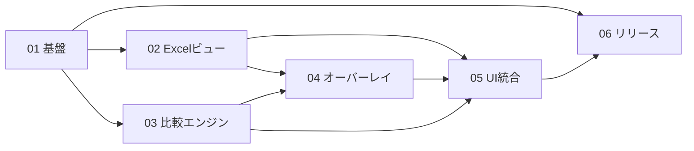

# DiffXL 全体ロードマップ

> **For agentic workers:** 実装時は各計画書を個別に実行する。REQUIRED SUB-SKILL: Use superpowers:subagent-driven-development または superpowers:executing-plans。進捗は各計画のチェックボックスで管理する。

**Goal:** 要件定義（`10_管理資料/要件定義.md` 版 0.4）を、依存関係の明確な複数計画に分割し、段階的に実装・検証できるようにする。

**Architecture:** WPF（x64）ホスト上で Excel 本体を埋め込み表示し、差分は半透明オーバーレイと OpenCV で扱うハイブリッド構成。実行時データは `%AppData%\Roaming\DiffXL`、配布は単一 exe。

**Tech Stack:** .NET Framework 4.8 / WPF / Excel COM / OpenCV x64 / YamlDotNet / Costura.Fody（または同等）

## Global Constraints

- 対象 OS: Windows **x64 のみ**
- 対象ファイル: **`.xlsx` のみ**
- ビュー: **Excel 本体描画** ＋ 差分補助（A3 ハイブリッド）。1px ずれ不可
- Excel バージョン: **ローカル `.xlsx` を開けるデスクトップ Excel の全バージョン**
- OpenCV: **x64 のみ**
- 差分色既定: **黄色・不透明度 50%**。設定で変更可
- 差分強調: **表示／非表示トグル**で切替（データは保持）
- 保存先: `%AppData%\Roaming\DiffXL\`（settings / logs / cache / native）
- 配布: 原則 **`DiffXL.exe` のみ**
- ソースコメント: メソッド・クラス・変数の直上に **日本語コメント必須**
- OSS: 最大限利用。必要ならソース改修して取り込み

---

## 1. 計画書一覧と成果物

| 順 | 計画書 | 主な成果物 | 単独で確認できること |
|----|--------|------------|----------------------|
| 0 | 本ロードマップ | 依存関係・順序 | — |
| 1 | `01_基盤_AppData設定ログ_x64単一exe.md` | AppData、Log、Settings、x64、Costura | 設定の読み書き・ログ出力・Release で exe 中心の出力 |
| 2 | `02_ExcelCOMハイブリッドビュー.md` | Excel 埋め込み左右ビュー | 任意 Excel で `.xlsx` を左右表示（読み取り専用） |
| 3 | `03_比較エンジン_xlsx_OpenCV.md` | DiffEngine、画像抽出、OpenCV 差分 | コンソール／単体テスト相当で差分リスト生成 |
| 4 | `04_差分オーバーレイ_色_表示切替.md` | オーバーレイ・色設定・トグル | 黄色 50% 強調と ON/OFF |
| 5 | `05_UI統合_同期スクロール_MiniMap.md` | SCR-01〜06、同期、MiniMap | 起動から比較までの一連操作 |
| 6 | `06_リリース配布_検証.md` | `40_リリース`、検証チェックリスト | クリーン PC 想定の単一 exe 動作 |

---

## 2. 依存関係



- **01** は全計画の前提。最初に完了させる。
- **02** と **03** は 01 完了後に **並行可能**。
- **04** は 02（表示ホスト）と 03（差分データ）の両方が必要。
- **05** は 02・03・04 を束ねる。
- **06** は機能一式の後。

---

## 3. 推奨実施順序（フェーズ）

### フェーズ A — 土台（計画 01）

1. ソリューションを x64 固定
2. AppData パス解決・ログ・YAML 設定
3. Costura.Fody 等でマネージ DLL 埋め込みの骨組み
4. ネイティブ DLL 展開フック（OpenCV 用ディレクトリ作成まで）

**完了条件:** Debug 起動で `settings.yaml` と当日ログが AppData に生成される。

### フェーズ B — 表示と比較（計画 02・03 並行）

| トラック B1（02） | トラック B2（03） |
|-------------------|-------------------|
| Excel 検出（全バージョン） | `.xlsx` ZIP 解析・画像抽出 |
| 左右ホストにブック表示 | シート対応・テキスト差分 |
| 読み取り専用・プロセス寿命 | OpenCV x64 画像差分 |
| 失敗時エラー UX | 差分結果モデル `DiffResult` |

**完了条件:**  
- B1: 左右に同じまたは異なる `.xlsx` を Excel 見た目で表示  
- B2: 2 ファイルから差分一覧（テキスト／画像）を生成できる  

### フェーズ C — 差分 UX（計画 04）

1. 差分矩形／領域をオーバーレイ描画
2. 既定色 `#80FFFF00` 相当（黄・50%）
3. 設定画面から色・不透明度変更
4. ツールバー「差分強調」トグル

**完了条件:** 差分 ON で黄色半透明、OFF で Excel 素表示、設定変更が YAML に残る。

### フェーズ D — アプリ統合（計画 05）

1. SCR-01〜06 の WPF 実装（プロトタイプ準拠）
2. 同期スクロール
3. MiniMap
4. シート対応・アンカー・再比較・片側差し替え

**完了条件:** プロトタイプ相当の操作フローが実データで一通り動く。

### フェーズ E — 出荷準備（計画 06）

1. Release x64・単一 exe 検証
2. ネイティブ展開の初回起動確認
3. Excel 未導入／非 xlsx／COM 失敗のエラー確認
4. `40_リリース` 配置と簡易 README

---

## 4. ディレクトリ方針（実装後の想定）

```
20_ソース/DiffXL/
  DiffXL.sln
  DiffXL/
    App.xaml(.cs)
    COMMON/          # Log, AppSettings, AppPaths, Common
    LOGIC/           # DiffEngine, XlsxReader, ImageDiff, ExcelHost
    VIEW/            # 各 Window / UserControl
    STYLE/           # 共通スタイル
    Properties/
    native/          # ビルド時に埋め込む OpenCV x64 バイナリ（リソース元）
  third_party/       # 改修した OSS ソース（必要時）
```

実行時:

```
%AppData%\Roaming\DiffXL\
  settings.yaml
  logs\DiffXL_yyyyMMdd.log
  cache\
  native\
```

---

## 5. 設定 YAML 初期スキーマ（計画 01・04 で確定実装）

```yaml
# %AppData%\Roaming\DiffXL\settings.yaml
diff:
  highlightEnabled: true          # 起動時の差分強調 ON/OFF 初期値（トグルで上書き可・任意で永続）
  highlightColor: "#FFFF00"       # RGB
  highlightOpacity: 0.5           # 0.0〜1.0（既定 50%）
ui:
  syncScroll: true
  rememberWindowBounds: true
paths:
  # 通常は空。デバッグ用に上書きする場合のみ
  cacheDir: ""
log:
  level: Info                     # Debug / Info / Error
```

---

## 6. リスクと早期検証項目

| リスク | 影響 | 早期検証（フェーズ） |
|--------|------|----------------------|
| Excel 埋め込みのバージョン差 | 表示・同期が壊れる | B1: 複数 Excel 環境でホスト |
| COM と WPF のフォーカス／DPI | 1px ずれ・ずれスクロール | B1: 100%/125%/150% DPI |
| OpenCV 単一 exe 展開 | 起動失敗 | A + E: native 展開パス |
| 左右 2 Excel インスタンス負荷 | メモリ・起動遅延 | B1: 大容量 xlsx |
| オーバーレイ座標の対応付け | 差分位置ずれ | C: 既知差分サンプル |

---

## 7. テスト用サンプル（全計画共通）

実装・検証時に次を `30_参考資料/samples/`（作成）へ用意する想定。

| サンプル | 用途 |
|----------|------|
| `text_only_left.xlsx` / `text_only_right.xlsx` | テキスト 1 セル差分 |
| `image_partial_left.xlsx` / `image_partial_right.xlsx` | 画像一部差分 |
| `image_added_left.xlsx` / `image_added_right.xlsx` | 片側のみ画像 |
| `sheet_mismatch_*.xlsx` | シート名不一致 |
| `layout_shapes.xlsx` | 図形・フォント・行高列幅の表示確認 |

---

## 8. 進捗トラッキング

| 計画 | 状態 | 備考 |
|------|------|------|
| 01 基盤 | 完了 | 2026-08-11 実装・Debug/Release 検証済 |
| 02 Excel ビュー | 完了 | 2026-08-11 実装・ビルド成功。実機で xlsx 埋め込み確認推奨 |
| 03 比較エンジン | 完了 | 2026-08-11 実装。text_only サンプルで差分1件を確認 |
| 04 オーバーレイ | 完了 | 2026-08-11 黄50%・トグル・設定画面 |
| 05 UI 統合 | 完了 | 2026-08-11 起動画面・同期・MiniMap・ダイアログ統合 |
| 06 リリース | 完了 | 2026-08-11 Release x64 を 40_リリース に配置 |

状態の更新はこの表と各計画書の Task チェックボックスの両方で行う。

---

## 9. 実行の進め方

1. 本ロードマップの Global Constraints を常に前提とする  
2. 計画 01 から順に（または 02/03 並行）各計画書の Task を消化する  
3. 計画完了ごとに上記進捗表を更新する  
4. 要件定義と矛盾が出たら **要件定義を先に直し**、計画を追随させる  

**実装実行オプション（計画実装フェーズに入るとき）:**

1. **Subagent-Driven（推奨）** — タスク単位でサブエージェント  
2. **Inline Execution** — 同一セッションで executing-plans  

---

## 改訂履歴

| 版 | 日付 | 内容 |
|----|------|------|
| 1.0 | 2026-08-11 | 初版。計画 01〜06 の分割と依存関係を定義 |
