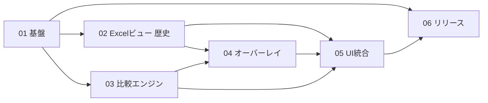

# DiffXL 全体ロードマップ

> **For agentic workers:** 実装時は各計画書を個別に実行する。REQUIRED SUB-SKILL: Use superpowers:subagent-driven-development または superpowers:executing-plans。進捗は各計画のチェックボックスで管理する。

**Goal:** 要件定義（`10_管理資料/要件定義.md` 版 **0.5**）を、依存関係の明確な複数計画に分割し、段階的に実装・検証できるようにする。

**Architecture（現行）:** WPF（x64）上の **自前内容ビュー** で左右の `.xlsx` 内容を表示し、OOXML 抽出＋部品比較（セル多重集合・テーブル行 LCS・画像系列 DP）＋ OpenCV で差分を示す。**Excel COM 埋め込みは廃止**。実行時データは `%AppData%\Roaming\DiffXL`、配布は単一 exe。

**Tech Stack:** .NET Framework 4.8 / WPF / OpenCV x64（OpenCvSharp）/ YamlDotNet / Costura.Fody（または同等）/ System.IO.Compression（OOXML）

> **方針転換（2026-08-12）:** 旧「Excel 本体描画が最重要（A3 ハイブリッド）」から **内容比較が最重要** へ。  
> 正本設計: [`docs/superpowers/specs/2026-08-12-content-based-diff-design.md`](../../docs/superpowers/specs/2026-08-12-content-based-diff-design.md)（**承認済み**）  
> 実装計画: [`docs/superpowers/plans/2026-08-12-content-based-diff.md`](../../docs/superpowers/plans/2026-08-12-content-based-diff.md)

## Global Constraints

- 対象 OS: Windows **x64 のみ**
- 対象ファイル: **`.xlsx` のみ**
- ビュー: **自前内容ビュー（WPF）**。Excel 1px 再現は目標としない
- Excel インストール: **不要**（COM 不使用）
- 比較キー: **内容**（セル番地・画像アンカー位置はメタデータのみ）
- OpenCV: **x64 のみ**
- 画像ハイライト既定: 枠 **赤 3px**、塗り **黄・不透明度 50%**
- 差分強調: **表示／非表示トグル**で切替（データは保持）
- MiniMap: **現在シートの差分のみ**（全シート横断禁止）
- 保存先: `%AppData%\Roaming\DiffXL\`（settings / logs / cache / native）
- 配布: 原則 **`DiffXL.exe` のみ**
- ソースコメント: メソッド・クラス・変数の直上に **日本語コメント必須**
- OSS: 最大限利用。必要ならソース改修して取り込み

---

## 1. 計画書一覧と成果物

| 順 | 計画書 | 主な成果物 | 単独で確認できること | 位置づけ |
|----|--------|------------|----------------------|----------|
| 0 | 本ロードマップ | 依存関係・順序 | — | 現行 |
| 1 | `01_基盤_AppData設定ログ_x64単一exe.md` | AppData、Log、Settings、x64、Costura | 設定の読み書き・ログ出力・Release で exe 中心の出力 | 維持 |
| 2 | `02_ExcelCOMハイブリッドビュー.md` | （旧）Excel 埋め込み左右ビュー | — | **歴史的計画（廃止）**。現行は内容ビュー |
| 3 | `03_比較エンジン_xlsx_OpenCV.md` | DiffEngine、画像抽出、OpenCV 差分 | コンソール／単体テスト相当で差分リスト生成 | 内容ベースへ拡張 |
| 4 | `04_差分オーバーレイ_色_表示切替.md` | オーバーレイ・色設定・トグル | 黄 50% 強調と ON/OFF | 内容ビュー上の強調へ移行 |
| 5 | `05_UI統合_同期スクロール_MiniMap.md` | SCR-01〜06、同期、MiniMap | 起動から比較までの一連操作 | 内容 UI へ移行 |
| 6 | `06_リリース配布_検証.md` | `40_リリース`、検証チェックリスト | クリーン PC 想定の単一 exe 動作 | Excel 前提を撤廃して追随 |
| 7 | `07_内容同期スクロール_画像完全対応.md` | 内容マップ同期 | 画像ギャップ・再同期 | 基盤（内容マップ） |
| 8 | `08_内容同期UX完成.md` | UX 完成 | 操作感シナリオ | 基盤 |
| **現行本線** | [`docs/superpowers/plans/2026-08-12-content-based-diff.md`](../../docs/superpowers/plans/2026-08-12-content-based-diff.md) | Excel 廃止・位置非依存比較・内容 UI | ContentDiffSmoke・Excel なし起動 | **2026-08-12 以降の本線** |

---

## 2. 依存関係

### 2.1 初期計画（01〜06・完了済み）



- **01** は全計画の前提。最初に完了させる。
- **02** は完了後、**内容ベース計画により Excel 埋め込みは廃止**された（成果物は履歴として残る）。
- **03〜06** は 2026-08-11 時点で一通り完了。

### 2.2 内容ベース計画（2026-08-12〜）


詳細タスク分解は `docs/superpowers/plans/2026-08-12-content-based-diff.md` を正とする。

---

## 3. 推奨実施順序（フェーズ）

### フェーズ A〜E — 初期リリース（計画 01〜06）

2026-08-11 完了。Excel ハイブリッド前提で骨格を構築した。

### フェーズ F — 内容同期（計画 07・08）

内容マップ同期・UX。詳細は各計画書を参照。

### フェーズ G — 内容ベース比較・Excel 廃止（現行本線）

1. 設計書レビュー・承認（済）
2. モデル拡張・OOXML 抽出（背景・border・表・図形）
3. セル bag / 表行 LCS / 画像 DP / 図形比較
4. ContentDiffSmoke ＋ `content_diff_*.xlsx`
5. 内容 UI（ContentPane / Table / Image / MiniMap 現在シート）
6. Excel COM 削除・起動チェック撤廃
7. 要件定義・ロードマップ・README の方針同期（本タスク群）

**完了条件（要約）:**

- `ContentDiffSmoke` が設計書 7.1 シナリオ PASS  
- Excel 未インストールで起動・比較・ハイライトトグル・シート切替・MiniMap（現在シートのみ）  
- Release|x64 ビルド成功、COM 参照なし  
- 要件定義が内容比較方針と矛盾しない  

---

## 4. ディレクトリ方針（実装後の想定）

```
20_ソース/DiffXL/
  DiffXL.sln
  DiffXL/
    App.xaml(.cs)
    COMMON/          # Log, AppSettings, AppPaths, Common, NativeBootstrap
    LOGIC/           # DiffEngine, ContentExtractor, Aligners, ImageDiff
    VIEW/            # 各 Window / ContentPane / TableDiffGrid / ImagePairView
    STYLE/           # 共通スタイル
    Properties/
  third_party/       # 改修した OSS ソース（必要時）
```

実行時:

```
%AppData%\Roaming\DiffXL\
  settings.yaml
  logs\DiffXL_yyyyMMdd.log
  cache\
  native\
```

---

## 5. 設定 YAML 初期スキーマ（計画 01・04・内容ベースで拡張）

```yaml
# %AppData%\Roaming\DiffXL\settings.yaml
diff:
  highlightEnabled: true          # 起動時の差分強調 ON/OFF 初期値
  highlightColor: "#FFFF00"       # RGB（一般差分）
  highlightOpacity: 0.5           # 0.0〜1.0（既定 50%）
  # 画像ハイライト（内容ベース）: 枠色・枠幅・塗り色・α 等は実装に追随
ui:
  syncScroll: true
  rememberWindowBounds: true
paths:
  cacheDir: ""
log:
  level: Info                     # Debug / Info / Error
```

---

## 6. リスクと早期検証項目

| リスク | 影響 | 早期検証 |
|--------|------|----------|
| border 表検出の取りこぼし | 表がバラセル扱い | TableDetector スモーク・content_diff |
| 画像 DP の誤マッチ | 片側のみの誤判定 | 8vs9 シナリオ・ContentDiffSmoke |
| OpenCV 単一 exe 展開 | 起動失敗 | native 展開パス |
| 巨大画像メモリ | 比較失敗・遅延 | large_image サンプル |
| 旧 COM 前提ドキュメントの残存 | ユーザー誤解 | 要件・README・リリース README |

---

## 7. テスト用サンプル（全計画共通）

`30_参考資料/samples/` に配置。詳細は同フォルダ `README.md`。

| サンプル | 用途 |
|----------|------|
| **`content_diff_left.xlsx` / `content_diff_right.xlsx`** | **内容ベース必須シナリオ（設計書 §7.1）** |
| `full_feature_left.xlsx` / `full_feature_right.xlsx` | フル機能回帰 |
| `content_scroll_left.xlsx` / `content_scroll_right.xlsx` | 内容同期スクロール |
| `text_only_left.xlsx` / `text_only_right.xlsx` | テキスト最小スモーク |
| `large_image_left.xlsx` / `large_image_right.xlsx` | 大画像ストレス |

再生成の主軸:

```text
python 30_参考資料/samples/_gen/create_content_diff_samples.py
```

---

## 8. 進捗トラッキング

| 計画 | 状態 | 備考 |
|------|------|------|
| 01 基盤 | 完了 | 2026-08-11 実装・Debug/Release 検証済 |
| 02 Excel ビュー | 完了→**廃止** | 2026-08-11 実装。2026-08-12 内容ベース計画で COM 削除 |
| 03 比較エンジン | 完了→拡張 | 内容ベース（bag / 表 / 画像 DP）へ拡張 |
| 04 オーバーレイ | 完了→移行 | 内容ビュー上の強調・画像ハイライトへ |
| 05 UI 統合 | 完了→移行 | 内容 UI・選択同期・MiniMap 現在シート |
| 06 リリース | 完了 | Excel 不要を 40_リリース README に反映 |
| 07 内容同期スクロール | 完了 | 内容マップ基盤 |
| 08 内容同期 UX | 完了 | UX シナリオ |
| **内容ベース比較** | 実装中〜文書同期 | `docs/superpowers/plans/2026-08-12-content-based-diff.md` |

状態の更新はこの表と各計画書の Task チェックボックスの両方で行う。

---

## 9. 実行の進め方

1. 本ロードマップの **Global Constraints（内容ベース）** を常に前提とする  
2. 新規機能は **内容ベース計画** を正とし、01〜06 の旧記述と矛盾する場合は要件定義 0.5 と設計書を優先する  
3. 計画完了ごとに上記進捗表を更新する  
4. 要件定義と矛盾が出たら **要件定義を先に直し**、計画を追随させる  

**実装実行オプション（計画実装フェーズに入るとき）:**

1. **Subagent-Driven（推奨）** — タスク単位でサブエージェント  
2. **Inline Execution** — 同一セッションで executing-plans  

---

## 改訂履歴

| 版 | 日付 | 内容 |
|----|------|------|
| 1.0 | 2026-08-11 | 初版。計画 01〜06 の分割と依存関係を定義 |
| 1.1 | 2026-08-12 | **内容ベース比較方針を本線化**。計画 02 を歴史的位置づけに。設計書・実装計画への参照、Global Constraints・サンプル・進捗表を更新 |
